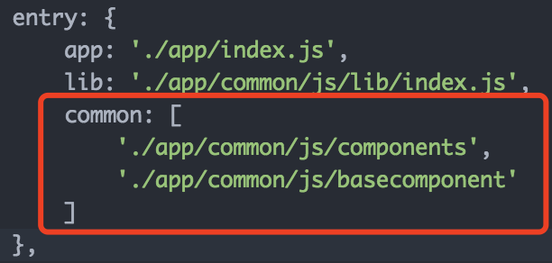
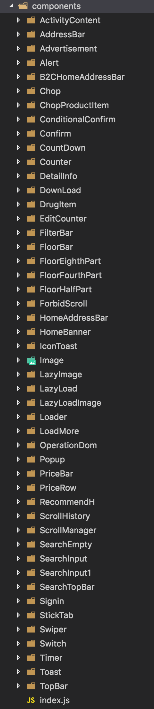
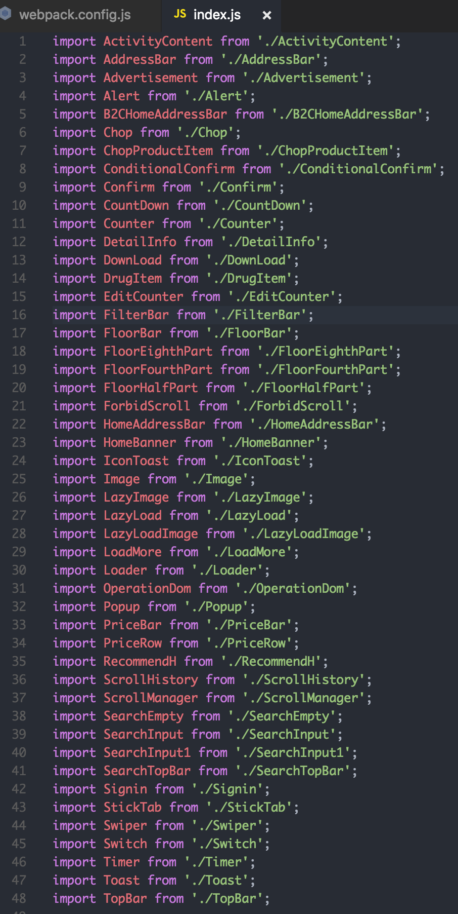
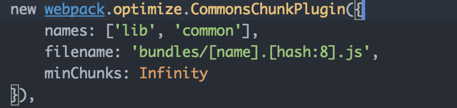

存在的性能问题：
app/common目录下是公用的模块和资源
app/modules目录下是按页面划分的模块，每个页面及其组件都引用了app/common目录下的公用模块和资源。
开发过程中，观察打包后的文件，发现打包后的每个页面的文件重复打包了公用的模块。
例如：搜索页search模块引用了app/common/js/components/DrugItem组件，店铺列表页storeList模块也引用了app/common/js/components/DrugItem组件，打包后在search.chunk.js和storeList.chunk.js中都包含了DrugItem组件。
导致最终打包的js文件过大。

解决方案：通过webpack提取公共的资源到一个单独的chunk文件
步骤：
1.  需要在webpack的entry配置项中添加一个common字段，用于CommonChunksPlugin的names字段指定要提取公共模块的入口文件。

2.  在entry字段中指定的文件或目录，webpack默认是通过require来解析指定的文件，如果指定的是一个目录，那么require默认找该目录下的index.js文件，因此思路是在app/common/js/components这个目录下创建一个index.js，用这个index.js来引入components目录下的所有组件，相当于整合了该目录下的所有文件，webpack引用index.js时候，就相当于引用了index.js文件中引入的模块。由于app/common/js/components下已经有很多公用的组件，手动去在index.js里写import xxx from 'xxx'很不自动化。因此考虑用nodejs脚本进行io操作，遍历app/common/js/components下的所有目录并写入index.js。

3.  最后通过webpack的优化插件CommonChunksPlugin，即可完成打包时，将每个页面模块中使用的公共组件和资源提取出来的目的。

结果：

最终打包后的dist目录总大小，由3.7MB 减少为 2.8MB
每个按需加载的页面模块都减少了若干KB（除去了公共组件和资源）
但由于公共的组件和资源都打包进了一个单独的common.js文件，导致增加了一个http连接数，并且首次加载的资源较以前大了150KB
左图是没有抽取公共组件和资源的文件目录大小，右图是抽取了公共组件和资源的文件目录大小
此次优化已包含在健康商城2017.02.28迭代版本

